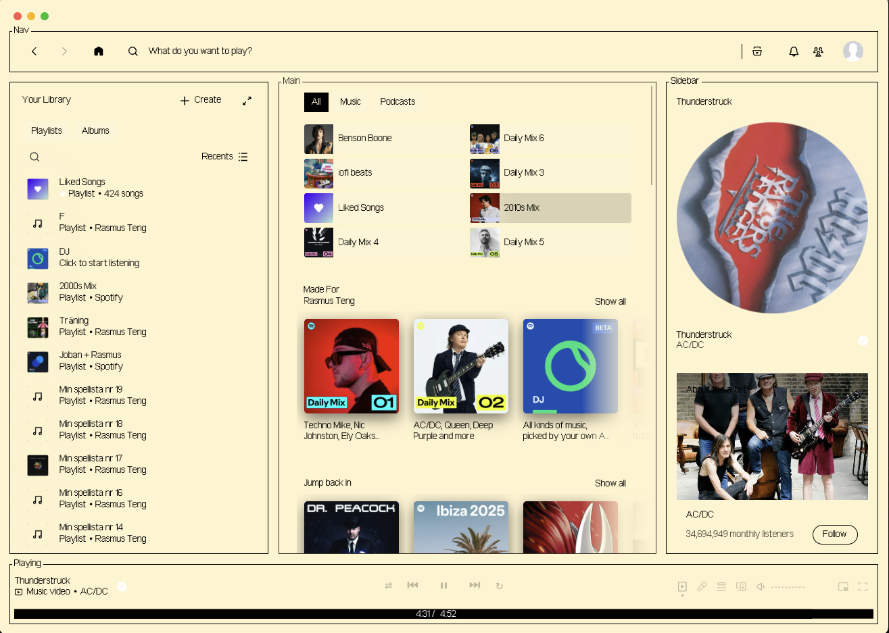

# text

## Screenshots

#### Display Images

### Retro
<picture>
  <source srcset="screenshots/Retro.gif" type="image/gif">
  
</picture>


## More

### Description

A spicetify theme that was gonna look "retro" 

Insperation was from [poolsuite](https://poolsuite.net/)

### Credits

The base of the theme was taken from [spectify-text](https://github.com/spicetify/spicetify-themes/tree/master/text) and made by [darkthemer](https://github.com/darkthemer/)


The rotating vinyl was inspired from [Turntables](https://github.com/spicetify/spicetify-themes/tree/master/Turntable)

### Installation
First install [Arial-pixel](https://www.dafont.com/pixel-arial-14.font)

Clone this repo and place it into your spicetify/Themes

Then run:
```shell
spicetify config current_theme text-Retro
spicetify config color_scheme Retro
spicetify config inject_theme_js 1
spicetify apply
```

### Notes

Its still in WIP, for example settings does not look good with the retro theme

-   **SUGGESTION:** Feel free to edit `color.ini` to swap the accent color (it's green for most of them) into your preferred color based from the color pallete.

    -   https://github.com/catppuccin/catppuccin
    -   https://github.com/dracula/dracula-theme
    -   https://github.com/morhetz/gruvbox
    -   https://github.com/rebelot/kanagawa.nvim
    -   https://github.com/nordtheme/nord
    -   https://github.com/Rigellute/rigel
    -   https://github.com/rose-pine/rose-pine-theme
    -   https://github.com/altercation/solarized
    -   https://github.com/enkia/tokyo-night-vscode-theme
    -   https://github.com/sainnhe/everforest

-   **SUGGESTION:** Check the very top of `user.css` for user settings

    -   If you use the Marketplace, go to `Marketplace > Snippets > + Add CSS` and then paste the variables found in `user.css` (also below). Edit these as you wish. If you're following this method, don't forget to add `!important` at the end of each property.

```css
/* user settings */
:root {
    --font-family: "JetBrains Mono", monospace;
    /*
    --font-family: 'Anonymous Pro', monospace;
    --font-family: 'Azeret Mono', monospace;
    --font-family: 'B612 Mono', monospace;
    --font-family: 'Courier Prime', monospace;
    --font-family: 'Cousine', monospace;
    --font-family: 'Cutive Mono', monospace;
    --font-family: 'DM Mono', monospace;
    --font-family: 'Fira Code', monospace;
    --font-family: 'Fira Mono', monospace;
    --font-family: 'IBM Plex Mono', monospace;
    --font-family: 'JetBrains Mono', monospace;
    --font-family: 'M PLUS 1 Code', monospace;
    --font-family: 'Major Mono Display', monospace;
    --font-family: 'Monofett', monospace;
    --font-family: 'Nova Mono', monospace;
    --font-family: 'Overpass Mono', monospace;
    --font-family: 'Oxygen Mono', monospace;
    --font-family: 'PT Mono', monospace;
    --font-family: 'Roboto Mono', monospace;
    --font-family: 'Share Tech Mono', monospace;
    --font-family: 'Sometype Mono', monospace;
    --font-family: 'Sono', monospace;
    --font-family: 'Source Code Pro', monospace;
    --font-family: 'Space Mono', monospace;
    --font-family: 'Syne Mono', monospace;
    --font-family: 'Ubuntu Mono', monospace;
    --font-family: 'VT323', monospace;
    --font-family: 'Xanh Mono', monospace;
    */
    --font-size: 14px;
    --font-weight: 400; /* 200 : 900 */
    --line-height: 1.2;

    --font-size-lyrics: 14px; /* 1.5em (default) */

    --font-family-header: "asciid";
    --font-size-multiplier-header: 4;

    --display-card-image: block; /* none | block */
    --display-coverart-image: none; /* none | block */
    --display-header-image: none; /* none | block */
    --display-sidebar-image: block; /* none | block */
    --display-tracklist-image: none; /* none | block */
    --display-spicetify-banner-ascii: block; /* none | block */
    --display-music-banner-ascii: none; /* none | block */

    --border-radius: 0px;
    --border-width: 1px;
    --border-style: solid; /* dotted | dashed | solid | double | groove | ridge | inset | outset */
    --border-transition: 0.2s ease; /* 'none' to disable  */

    --global-nav-margin-top: 40px /* set to '0px' if you disabled window controls */
}
```

-   **SUGGESTION:** For Windows users, here's how to make the window controls' background match with the topbar background

    -   Enable [CEF/Spotify Tweaks](https://windhawk.net/mods/cef-titlebar-enabler-universal) in Windhawk (recommended)

    -   Alternatively, Put this snippet into your `user.css` (or through the Marketplace's `+ Add CSS` feature)

```css
/* transparent window controls background */
.spotify__container--is-desktop:not(.fullscreen) body::after {
    content: "";
    position: absolute;
    right: 0;
    z-index: 999;
    
    backdrop-filter: brightness(2.12);
    /* page zoom [ctrl][+] or [ctrl][-]
       edit width and height accordingly */
    width: 135px;
    /* depending on what global status bar
       style is enabled height need to be
       changed accordingly. */
    height: 32px;
    margin-top: 16px;
}
```


